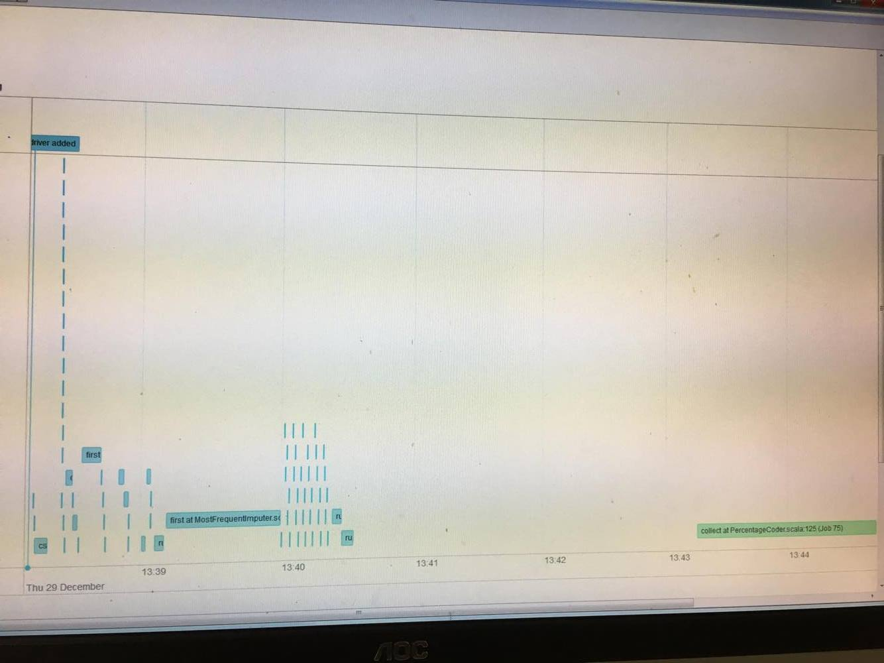

# spark improve speed of contrast coding

For a machine learning task I need to deal with categorical columns. 
Some of these contain a high number of factor variables.
Usually one would dummy-code these. However due to the high number of distinct strings (#factor-levels) per columns,
this may blow up the data frame too much / not produce the desired results.

One solution commonly applied in statistics is to perform contrast coding.
Som popular coding schemes are [http://www.ats.ucla.edu/stat/r/library/contrast_coding.htm](http://www.ats.ucla.edu/stat/r/library/contrast_coding.htm)
implemented for R.
Currently Spark is lacking such functionality.

As I am dealing with a binary classification problem my idea was to 'measure' the effect from a certain factor level on the 
`TARGET` variable and decided to perform percentage coding.

This repository contains a `PercentageCoder` for spark. 

However it is slow. For the minimal example here a fit may take around 6 Seconds. The transform is rather quick, but slow to build up due to the collect.
  - I noticed that `run at ThreadPoolExecutor.java:1142` appears very often. Is this a problem?
[http://stackoverflow.com/questions/41298550/spark-threadpoolexecutor-java-in-spark-tasks](http://stackoverflow.com/questions/41298550/spark-threadpoolexecutor-java-in-spark-tasks)
  - spark is spending a lot of the time in the garbage collection
  - sometimes 0 tasks are launched but still the driver is waiting
  - The DAG was already sort of optimized [http://stackoverflow.com/questions/41169873/spark-dynamic-dag-is-a-lot-slower-and-different-from-hard-coded-dag](http://stackoverflow.com/questions/41169873/spark-dynamic-dag-is-a-lot-slower-and-different-from-hard-coded-dag),
but still is one of the slowest operations in my pipeline. 

Executing `sbt test` contains some test cases which show how to use `PercentageCoder`.

*I am looking forward to any ideas how to speed this thing up*
 Thanks a lot.

Sample output would look like:

```
+----+----+----------+-----------+----+------------------+---------+------------------+---------+
|col1|col2|TARGET    |col3TooMany|col4|          pre_col1|pre2_col1|          pre_col2|pre2_col2|
+----+----+----------+-----------+----+------------------+---------+------------------+---------+
|   A|   B|         0|          C|   D|0.6666666666666666|     0.25|0.6666666666666666|     0.25|
|   c|   B|         1|          C|   D|               1.0|     0.25|0.6666666666666666|      0.5|
|   A|   d|         1|          t|   k|0.6666666666666666|      0.5|               1.0|     0.25|
|   d|   c|         1|          C|   D|0.3333333333333333|     0.25|               1.0|     0.25|
|   d|   a|         0|        jkl|   d|0.3333333333333333|      0.5|               0.0|     0.25|
|   d|   g|         0|          C|   D|0.3333333333333333|      0.5|               0.0|     0.25|
|   A|   B|         1|          C|   D|0.6666666666666666|      0.5|0.6666666666666666|      0.5|
+----+----+----------+-----------+----+------------------+---------+------------------+---------+
```
## Proposed improvements

- maybe use RDD api and something similar to http://stackoverflow.com/questions/25171070/spark-processing-columns-in-parallel

## Event timeline

 Why is there such a huge delay until this task starts after loading and cleaning of the data?

Why is spark spending so much time (see logs) in the code generator?
